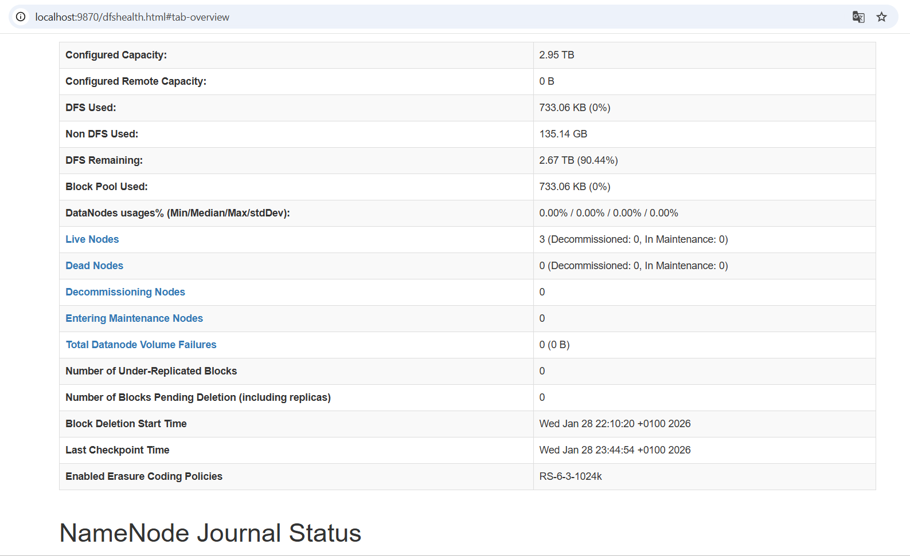
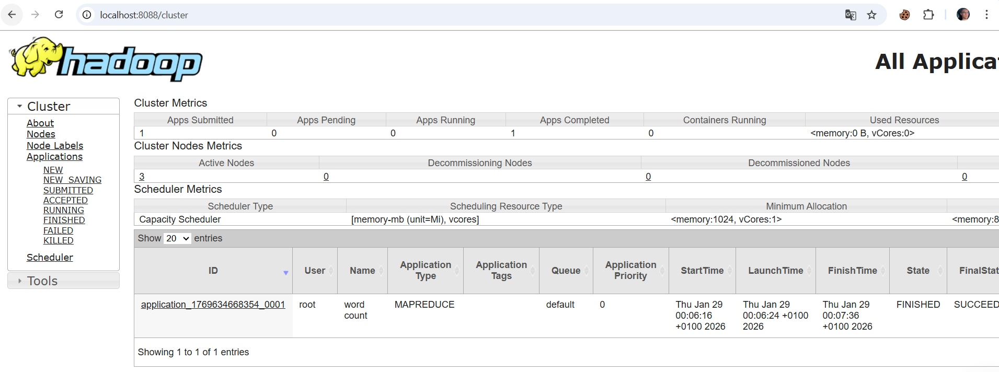
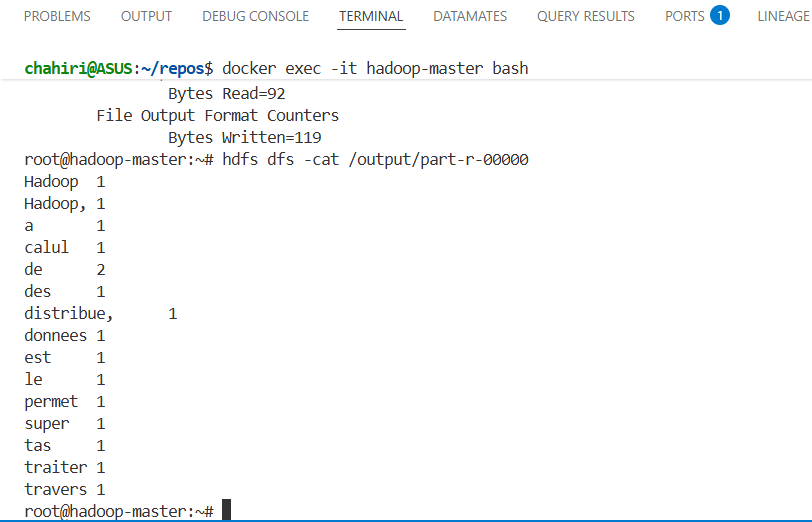

# Distributed Hadoop Cluster Deployment & WordCount Analysis

This project documents the implementation of a full Hadoop cluster (HDFS + YARN) using Docker, as well as the execution of a classic MapReduce job (WordCount) to validate distributed processing.

## 🏗 Cluster Architecture

The cluster is deployed on Ubuntu-based Docker containers and includes the following services:

* **NameNode**: File System Manager (HDFS Master).
* **ResourceManager**: Resource Manager (YARN Master).
* **DataNodes (x3)**: Data Storage.
* **NodeManagers (x3)**: Task Execution.
* **SecondaryNameNode**: Checkpointing for the NameNode.

## ✅ Cluster Status Verification

Once the containers are launched and port conflicts resolved, here is the status of the services.

### 1. HDFS Status (Storage)
The NameNode Web UI (`http://localhost:9870`) confirms that the cluster is healthy with **3 Live Nodes** and a configured capacity of **2.95 TB**.



### 2. YARN Status (Computation)
The ResourceManager Web UI (`http://localhost:8088`) shows **3 Active Nodes** ready to accept tasks.



---

## 🚀 MapReduce Job Execution: WordCount

The goal of this test was to count word frequencies in a text file stored on HDFS.

**Execution Command:**
```bash
hadoop jar $HADOOP_HOME/share/hadoop/mapreduce/hadoop-mapreduce-examples-*.jar wordcount /input /output


**Result in YARN:**
As shown in the screenshot below, the application was "SUBMITTED", accepted, and completed successfully ("FINISHED / SUCCEEDED").



### Technical Observation: Tokenization

Upon analyzing the results (`hdfs dfs -cat /output/part-r-00000`), a significant observation was made regarding the default `WordCount` behavior.

> **Observation:**
> "For Hadoop, `Hadoop` and `Hadoop,` (with an attached comma) are considered two different words."

**Technical Explanation:**
The standard `WordCount` example uses a basic **Tokenizer** that splits strings based solely on whitespace. It does not contain built-in logic to handle punctuation or case sensitivity (uppercase/lowercase).

* **Input:** `"Hello Hadoop, hello hadoop"`
* **Raw Output:**
* `Hello`: 1
* `Hadoop,`: 1  <-- The comma is included in the token
* `hello`: 1
* `hadoop`: 1


## 🛠 Useful Commands

To reproduce this project:

* **Start the cluster:** `start-dfs.sh && start-yarn.sh`
* **Check processes:** `jps`
* **List HDFS files:** `hdfs dfs -ls /`